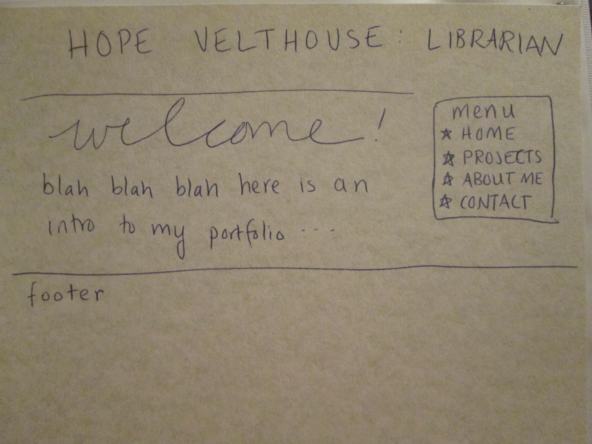
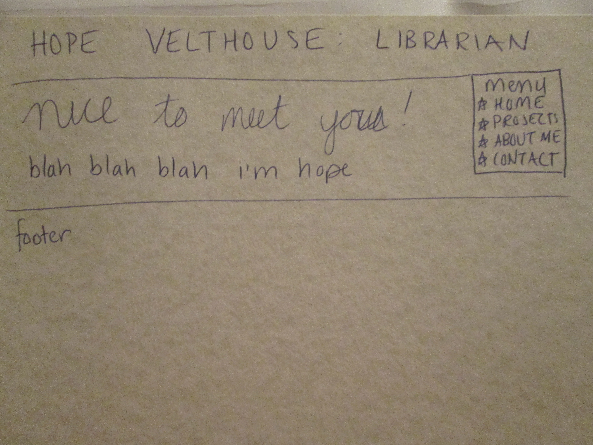
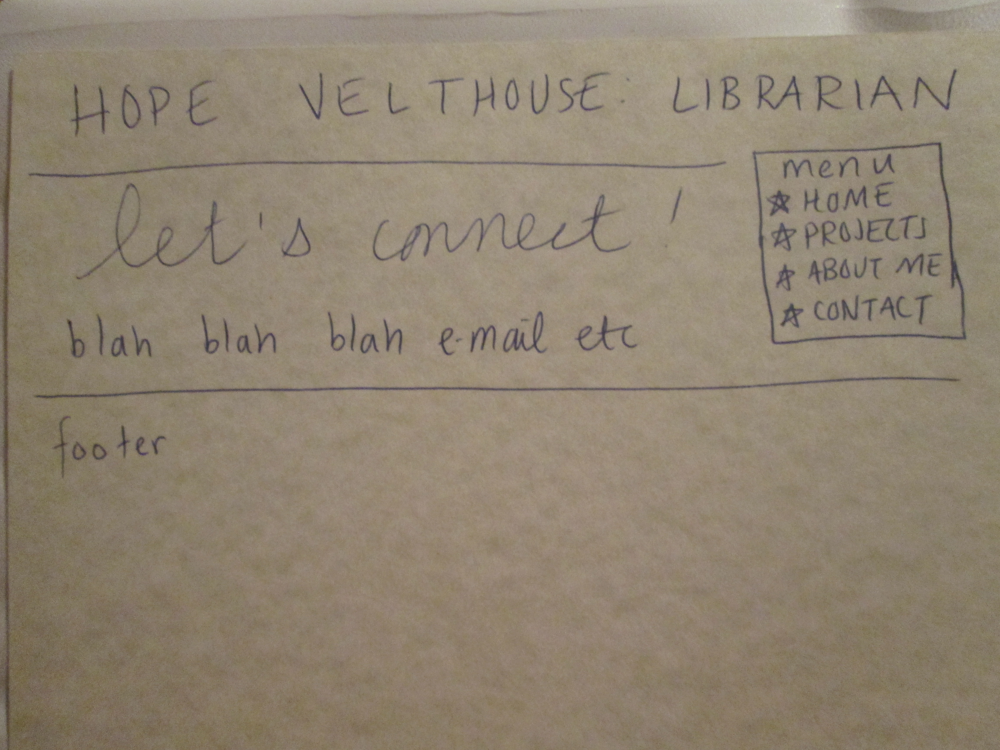

# Hope Velthouse's INF6420 Project

A portfolio site showcasing my work.

## Wireframes

### Landing Page

Header - will include my name 

Navigation Menu - will include links to other pages on the site

Main Content - will include introduction to my portfolio 

Footer - will include copyright information

### About Me Page

Header - will include my name

Navigation Menu - will include links to other pages on the site

Main Content - will include short biography and description of professional goals

Footer - will include copyright information

### Contact Page

Header - will include my name

Navigation Menu - will include links to other pages on the site

Main Content - will include all contact information

Footer - will include copyright information